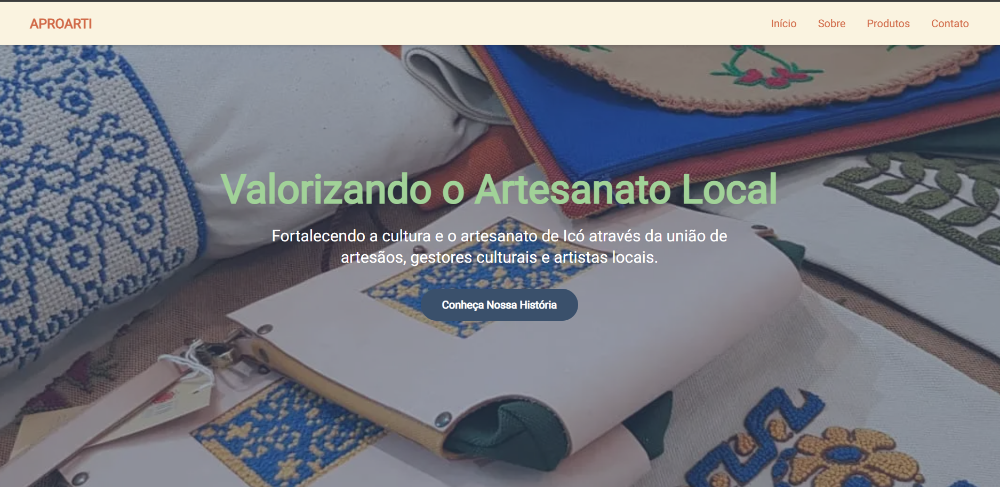
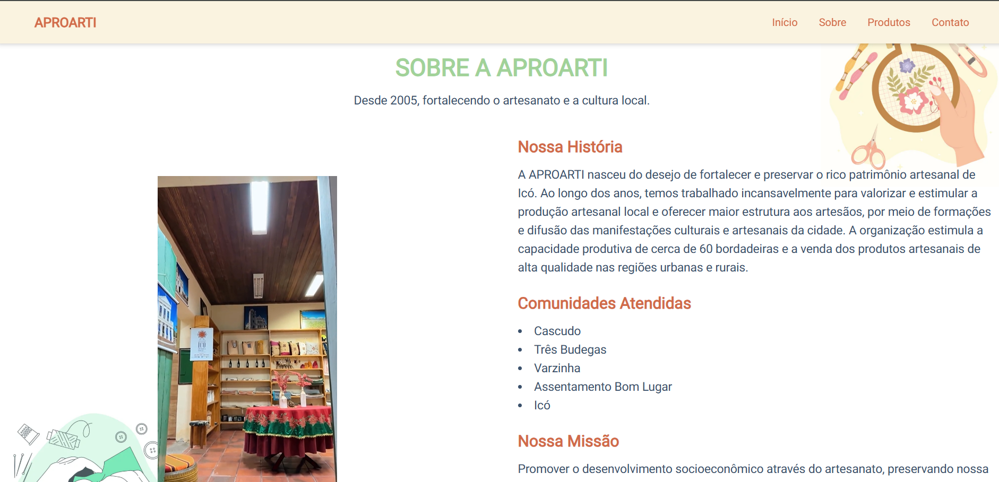
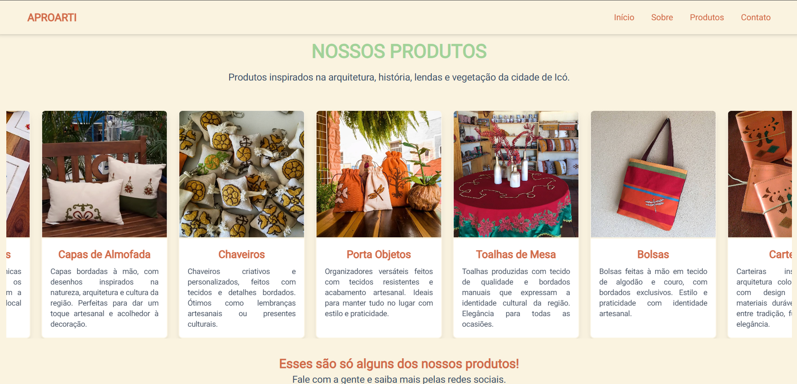
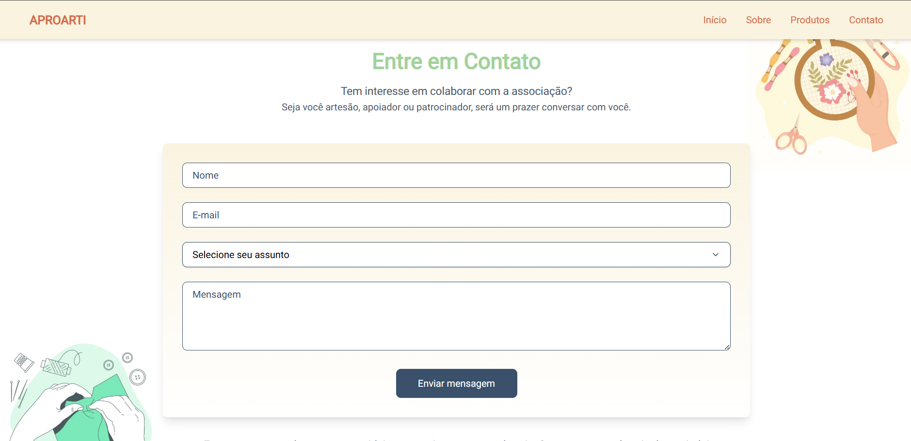

# 🎨 Associação de Artesanato Local - Site Institucional

Este é um site institucional desenvolvido como parte de um projeto de extensão universitária. O objetivo é aplicar habilidades em desenvolvimento web para promover e valorizar o trabalho de artesãos e artistas locais por meio de uma presença digital moderna, acessível e informativa.

<div align="center">
  
  
  
  
</div>

## 🚀 Tecnologias Utilizadas

**Frontend**

- **Next.js** – Framework para React com foco em performance e SEO.
- **React.js** – Biblioteca JavaScript para construção de interfaces modernas e reativas.
- **TypeScript** – Superset do JavaScript que adiciona tipagem estática e melhora a produtividade e manutenção do código.
- **Tailwind CSS** – Framework de utilitários CSS para estilização rápida e responsiva.
- **PostCSS** – Ferramenta de processamento de CSS usada com Tailwind para transformar estilos com plugins.
- **Lucide React** – Conjunto de ícones open-source para React, leve e personalizável.
- **@headlessui/react** – Componentes acessíveis e sem estilo pré-definido, ideais para usar com Tailwind CSS.

**Integrações**

- **EmailJS** – Biblioteca para envio de e-mails diretamente do front-end, sem necessidade de um servidor backend.

## 📌 Funcionalidades Principais

**Home:**

- Apresenta a missão e uma imagem de destaque da associação.

**Sobre:**

- Mostra a história, comunidades atendidas e objetivos da associação.

**Produtos:**

- Galeria com produtos artesanais e descrições (sem fins comerciais).

**Contato:**

- Formulário para envio de mensagens, voltado para colaboradores, artesãos e patrocinadores.

**Navegação e Interface:**

- Navegação simples entre seções.
- Design responsivo para todos os dispositivos.
- Footer com informações de contato e redes sociais.

## 🧠 Organização do Código

Estrutura das pastas e arquivos do projeto:

```
📁 public                        # Arquivos públicos como imagens e ícones acessíveis diretamente
📁 src
├─ 📁 app                        # Estrutura de rotas e páginas do Next.js
├─ 📁 components                 # Componentes reutilizáveis da interface
│  ├─ 📁 About                   # Seção "Sobre"
│  ├─ 📁 Contact                 # Seção de contato com formulário
│  ├─ 📁 Footer                  # Rodapé do site
│  ├─ 📁 Hero                    # Seção principal de destaque do site
│  ├─ 📁 NavBar                  # Componente da barra de navegação
│  ├─ 📁 Products                # Componente de exibição dos produtos
│  └─ 📁 ui                      # Componentes visuais reutilizáveis (UI)
├─ 📁 data
│  └─ 📄 products.json           # Arquivo com os dados dos produtos artesanais
```

## 🛠️ Como Rodar o Projeto

Para rodar o projeto localmente, siga os passos abaixo:

### Pré-requisitos

1. Clone este repositório:

   ```bash
   git clone https://github.com/islaianeribeiro/project-aproarti.git
   ```

2. Acesse a pasta do projeto:

   ```bash
   cd project-aproarti
   ```

3. Instale as dependências:
   ```bash
   npm install
   ```

### Configuração do Ambiente

Este projeto utiliza o **EmailJS** para envio de emails. Para configurá-lo, você precisará de algumas variáveis de ambiente, que devem ser configuradas no arquivo `.env.local` na raiz do projeto.

1. **Crie o arquivo `.env.local`** na raiz do seu projeto (se ainda não existir).
2. **Adicione as seguintes variáveis de ambiente** ao arquivo `.env.local`, substituindo pelos seus valores reais de **service ID**, **template ID** e **public Key** do EmailJS:

   ```env
   NEXT_PUBLIC_EMAILJS_SERVICE_ID=seu_service_id_aqui
   NEXT_PUBLIC_EMAILJS_TEMPLATE_ID=seu_template_id_aqui
   NEXT_PUBLIC_EMAILJS_PUBLIC_KEY=sua_public_key_aqui
   ```

### Rodando o servidor de desenvolvimento

Após configurar as variáveis de ambiente, inicie o servidor de desenvolvimento:

```bash
npm run dev
```

Acesse o projeto em [http://localhost:3000](http://localhost:3000).

---

## 📚 Conclusão

Este projeto foi desenvolvido com o propósito de conectar tecnologia e cultura, oferecendo uma ferramenta digital para divulgar o artesanato local. A iniciativa busca apoiar a associação e proporcionar mais visibilidade ao seu trabalho.

---

## 👩‍💻 Desenvolvido por

**Islaiane Ribeiro**
Front-End Developer

🔗 [https://www.linkedin.com/in/islaianeribeiro](https://www.linkedin.com/in/islaianeribeiro)

---

## 📝 Licença

MIT © 2025 — Sinta-se à vontade para usar como base para seus próprios projetos!
